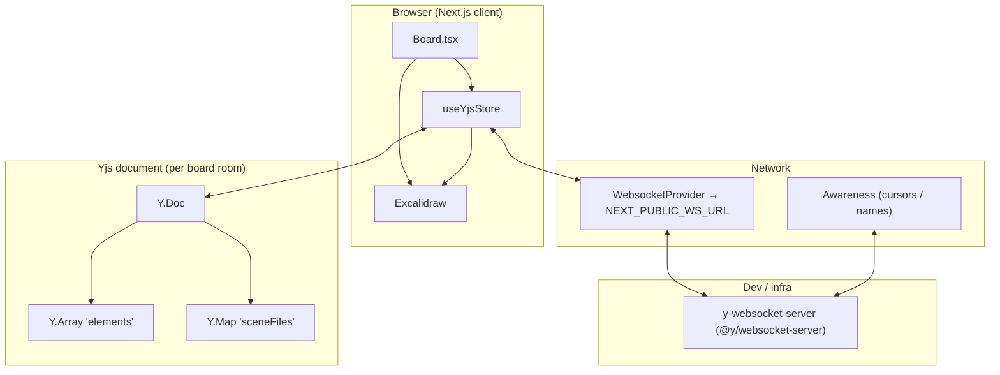

# Board realtime collaboration architecture

This folder connects **Excalidraw** (the whiteboard UI) to **Yjs** (CRDT document) and **y-websocket** (network sync). The HTTP API persists snapshots to the database; the websocket layer is for **live** multi-user editing, cursors, and lightweight image metadata.

## High-level diagram

## Responsibilities

| Piece | Role |
|--------|------|
| **`useYjsStore.ts`** | React lifecycle: create `Y.Doc` + `WebsocketProvider`, subscribe to updates, expose callbacks for `Board.tsx`. |
| **`yjs-board-bridge.ts`** | Pure transforms: Excalidraw element list ↔ Yjs maps/array; **no** React or I/O. |
| **`yjs-awareness.ts`** | Map y-websocket **awareness** state into Excalidraw **collaborators** (including pointers). |
| **`Board.tsx`** | Wires Excalidraw `onChange` → Yjs; passes pointer updates; shows connection status; **also** debounces REST saves (separate from Yjs). |
| **`board-scene-files.ts`** | Builds `{ fileId → { url, mimeType } }` patches for images (ImageKit URLs). Stored in `sceneFiles` so peers can `fetch` and `addFiles`. |
| **WebSocket server** | Relays Yjs binary updates and awareness between clients in the same room name (here: **board id**). |

## Y.Doc shape

- **`elements`**: `Y.Array` of `Y.Map`, each map is one flattened Excalidraw element (`Object.entries` / `toJSON`). The app **replaces** the whole array on each local commit (simple; CRDT still merges concurrent edits at the Yjs level).
- **`sceneFiles`**: `Y.Map` of `{ url, mimeType }` per Excalidraw file id. Binary bytes are **not** in Yjs; peers download by URL.

## End-to-end flows

### 1. Page load (one user)

1. `Board.tsx` loads the board over **REST** (`GET /api/boards/:id`) → Excalidraw gets `initialData` (elements + embedded files from DB).
2. When `boot.status === "ready"`, `useYjsStore` runs with `enabled: true`, creates a `Y.Doc`, connects `WebsocketProvider` to `ws://…/<boardId>` (or `NEXT_PUBLIC_WS_URL`).
3. **Late Excalidraw API**: The websocket may apply the first remote update **before** `excalidrawAPI` exists. A dedicated `useLayoutEffect` (when `api` becomes non-null) either **pushes** existing Y elements into Excalidraw or **seeds** Y from `getSceneElements()` if Y is still empty. Without this, awareness (frequent updates) can “work” while strokes never appear.
4. On `provider` **sync** (`sync` event with `true`), if the server had an **empty** doc and the canvas already has a restored scene, the hook **appends** local elements into Y so the room is not stuck empty.

### 2. Local edit

1. User draws → Excalidraw `onChange` → `Board` calls `onElementsChange(elements)` and `onSceneFilesChange(patch)` when `canEdit`.
2. `onElementsChange` runs a Yjs transaction: clear `elements` array, push new maps from each element (`replaceYElementsFromExcalidraw` in the bridge).
3. The provider’s internal `update` handler encodes the delta and sends it over the websocket **unless** the transaction origin is itself (echo suppression inside y-websocket).

### 3. Remote edit

1. Peer sends an update; server forwards; `Y.applyUpdate(doc, …, provider)` runs with **origin** = that `WebsocketProvider` instance.
2. `doc.on('update', …)` in `useYjsStore` runs only when `origin === provider` (i.e. change came **from the wire**, not purely local).
3. `pushYElementsToExcalidraw` reads the shared `Y.Array`, converts to Excalidraw elements, calls `updateScene({ captureUpdate: NEVER })`.
4. **`applyingRemoteRef`**: While applying remote data, `onElementsChange` **returns immediately** so Excalidraw does not write the same snapshot back into Y (prevents ping-pong).

### 4. Cursors and names

- Local pointer moves → `handlePointerUpdate` → `awareness.setLocalStateField('pointer', …)`.
- Remote awareness updates → `pushCollaborators` → `updateScene({ appState: { collaborators } })`.
- This path does not use `origin === provider` on `Y.Doc`; it uses **awareness** events, which is why cursors can look “fine” even when element wiring was broken.

### 5. Persistence vs realtime

- **Realtime**: Yjs + websocket only (in-memory on the server, no SQLite from the websocket server in the default setup).
- **Durable**: `Board.tsx` debounces `serializeAsJSON` → `PATCH /api/boards/:id` (scene JSON + scene file URLs). New joiners get the last saved snapshot from REST, then Yjs reconciles live deltas.

## Configuration

- **`NEXT_PUBLIC_WS_URL`**: Base WebSocket URL (no room suffix). Default in code: `ws://localhost:1234`.
- **`pnpm dev:ws`**: Runs `y-websocket-server` so `pnpm dev` clients can connect locally.

## Bundler note (Next.js)

`next.config.ts` aliases **`yjs`** to the prebuilt `dist/yjs.mjs` so Turbopack/webpack avoid TDZ issues with the package’s source entry. All packages must resolve the **same** physical `yjs` module so `Y.Doc` and `applyUpdate` stay compatible.

## Files to read next

- `src/components/canvas/Board.tsx` — `useYjsStore`, `onExcalidrawChange`, collab status UI.
- `src/lib/excalidraw/board-scene-files.ts` — `buildSceneFilePatchForYjs`, `YjsSceneFileEntry`.
- `next.config.ts` — `yjs` alias.
